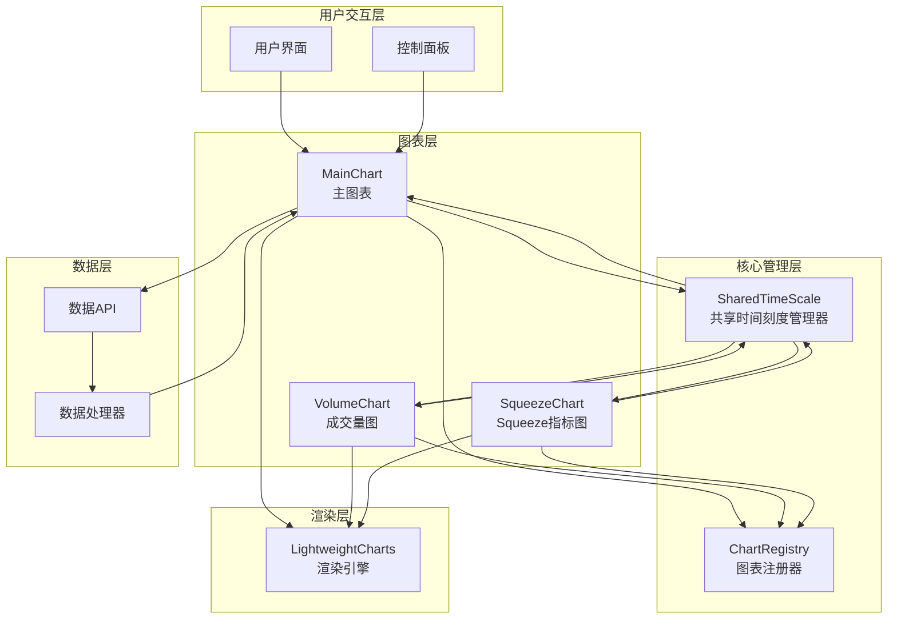
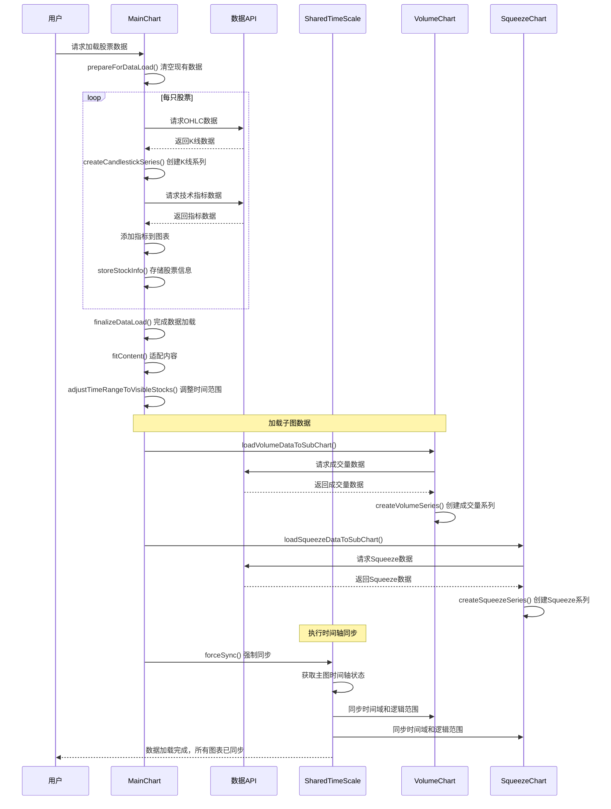
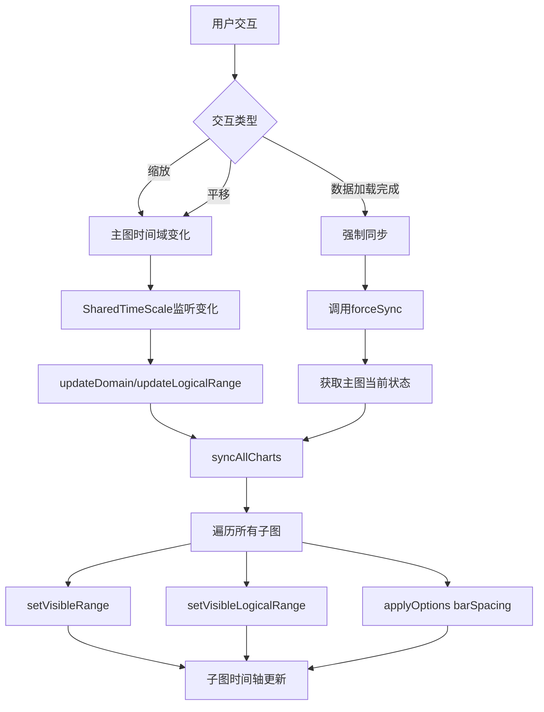
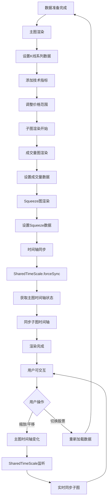

# LightweightCharts 多图表系统设计文档

## 1. 系统概述

本系统基于LightweightCharts库构建了一个多图表联动的金融数据可视化平台，支持主图表（K线图）和多个子图表（成交量图、技术指标图）的同步显示。

### 1.1 核心特性
- **多图表联动**: 主图和子图在时间轴上完全同步
- **共享时间刻度**: 统一的时间刻度管理器确保所有图表时间轴一致
- **动态数据加载**: 支持多股票、多指标的异步数据加载
- **实时同步**: 用户交互（缩放、平移）时所有图表实时同步
- **模块化设计**: 清晰的类层次结构和职责分离

## 2. 系统架构



## 3. 核心组件详细设计

### 3.1 SharedTimeScale (共享时间刻度管理器)

**职责**: 统一管理所有图表的时间轴同步

```javascript
class SharedTimeScale extends EventEmitter {
    constructor() {
        this.currentDomain = null;           // 当前时间域 {from, to}
        this.currentLogicalRange = null;     // 当前逻辑范围 {from, to}
        this.currentBarSpacing = null;       // 当前K线间距
        this.charts = new Map();             // 注册的图表实例
        this.isUpdating = false;             // 防止循环更新
    }
}
```

**核心方法**:
- `registerChart(chartId, instance, isPrimary)`: 注册图表
- `syncAllCharts()`: 同步所有子图到主图状态
- `forceSync()`: 强制同步所有图表
- `updateDomain(newDomain)`: 更新时间域
- `updateLogicalRange(newLogicalRange)`: 更新逻辑范围

### 3.2 MainChart (主图表类)

**职责**: 管理K线数据、技术指标和多股票显示

```javascript
class MainChart extends BaseChart {
    constructor(container) {
        // 注册到SharedTimeScale作为主图
        this.sharedTimeScale = globalTimeScale;
        this.sharedTimeScale.registerChart(this.chartId, this, true);
        
        this.stockInfos = [];           // 股票信息数组
        this.stockVisibility = [];      // 股票可见性状态
        this.seriesMap = new Map();     // 系列映射
        this.normalizationEnabled = false; // 归一化状态
    }
}
```

### 3.3 VolumeChart & SqueezeChart (子图表类)

**职责**: 显示成交量和技术指标数据，自动同步主图时间轴

```javascript
class VolumeChart extends BaseChart {
    constructor(container) {
        // 注册到SharedTimeScale作为子图
        this.sharedTimeScale = globalTimeScale;
        this.sharedTimeScale.registerChart(this.chartId, this, false);
    }
}
```

## 4. 数据加载流程



## 5. 时间轴同步机制

### 5.1 同步触发时机



### 5.2 同步算法核心

```javascript
syncAllCharts() {
    this.isUpdating = true; // 防止循环触发
    
    this.charts.forEach(({ instance, isPrimary }, chartId) => {
        if (!isPrimary && instance.chart) {
            const timeScale = instance.chart.timeScale();
            
            // 同步时间域
            if (this.currentDomain) {
                timeScale.setVisibleRange(this.currentDomain);
            }
            
            // 同步逻辑范围
            if (this.currentLogicalRange) {
                timeScale.setVisibleLogicalRange(this.currentLogicalRange);
            }
            
            // 同步barSpacing
            timeScale.applyOptions({
                barSpacing: this.currentBarSpacing,
                rightOffset: this.currentRightOffset
            });
        }
    });
    
    this.isUpdating = false;
}
```

## 6. 渲染流程



## 7. 关键问题与解决方案

### 7.1 逻辑范围不一致问题

**问题**: 主图和子图的逻辑范围经常不同步
- 主图: `{from: 0, to: 256}`
- 成交量图: `{from: 103.66, to: 256}`

**解决方案**: 
1. 使用SharedTimeScale统一管理
2. 在数据加载完成后强制同步
3. 监听主图时间轴变化，实时同步子图

### 7.2 barSpacing差异问题

**问题**: 不同图表的K线间距不一致

**解决方案**:
```javascript
// 在syncAllCharts中统一设置
timeScale.applyOptions({
    barSpacing: this.currentBarSpacing,
    rightOffset: this.currentRightOffset
});
```

### 7.3 数据加载时序问题

**问题**: 子图数据加载时机影响同步效果

**解决方案**:
```javascript
// 确保主图数据完全加载后再加载子图
setTimeout(async () => {
    await this.loadVolumeDataToSubChart(mainStockCode);
    setTimeout(() => {
        this.sharedTimeScale.forceSync();
    }, 100);
}, 100);
```

## 8. 性能优化策略

### 8.1 防抖机制
- 使用`isUpdating`标志防止循环同步
- 延迟执行同步操作，避免频繁更新

### 8.2 批量操作
- 将多个时间轴设置操作合并为一次
- 使用`setTimeout`确保DOM更新完成

### 8.3 内存管理
- 及时注销不需要的图表实例
- 清理事件监听器防止内存泄漏

## 9. 扩展性设计

### 9.1 添加新的子图表类型
```javascript
class NewIndicatorChart extends BaseChart {
    constructor(container) {
        super(container, chartConfig);
        
        // 注册到SharedTimeScale
        this.sharedTimeScale = globalTimeScale;
        this.sharedTimeScale.registerChart(this.chartId, this, false);
    }
}
```

### 9.2 自定义同步策略
```javascript
class CustomTimeScale extends SharedTimeScale {
    customSyncStrategy() {
        // 实现自定义同步逻辑
    }
}
```

## 10. 测试与调试

### 10.1 关键调试日志
- `🔧 [SHARED-TIME] 共享时间刻度管理器已创建`
- `📝 [SHARED-TIME] 注册图表: xxx, 主图: true/false`
- `🔄 [SHARED-TIME] 时间域更新: {from, to}`
- `✅ [SHARED-TIME] 图表 xxx 同步完成`

### 10.2 测试用例
1. **基础同步测试**: 验证主图和子图时间轴一致性
2. **交互测试**: 验证缩放、平移时的实时同步
3. **数据加载测试**: 验证多股票加载后的同步效果
4. **边界测试**: 验证极端数据情况下的稳定性

## 11. 总结

本设计通过SharedTimeScale实现了统一的时间轴管理，解决了多图表系统中的同步问题。核心优势：

1. **统一管理**: 所有时间轴相关操作集中处理
2. **实时同步**: 用户交互时自动同步所有图表
3. **扩展性强**: 新增图表类型只需注册到SharedTimeScale
4. **性能优化**: 防抖机制和批量操作提升性能
5. **易于维护**: 清晰的职责分离和模块化设计 